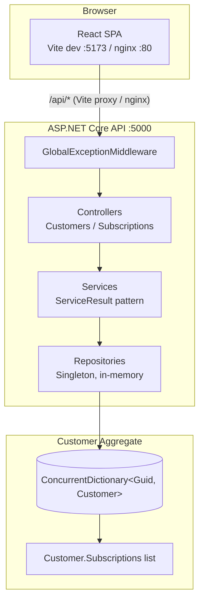
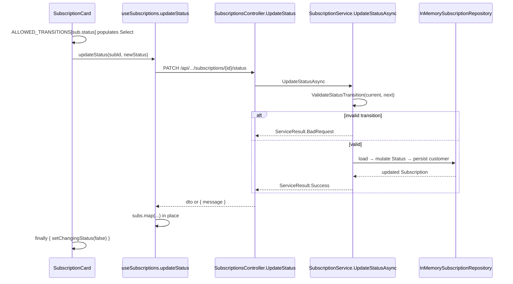

# Codebase Map

> Auto-generated by Cartographer. Last mapped: 2026-05-14T18:14:21Z

A small full-stack subscription management app: an ASP.NET Core 8 Web API backend
backed by in-memory storage, paired with a React 18 + Vite SPA that talks to it
through a thin `fetch` wrapper. **Customer is the aggregate root**; `Subscription`
lives inside `Customer.Subscriptions` and is always accessed via
`/api/customers/{customerId}/subscriptions/...`.

## System Overview



## Directory Structure

```
subscription-manager/
├── backend/
│   ├── Dockerfile                              # Multi-stage .NET 8 build, exposes :5000
│   └── src/SubscriptionManager.Api/            # Single ASP.NET Core project
│       ├── Program.cs                          # DI, JSON, CORS, Swagger, pipeline wiring
│       ├── appsettings.json                    # Urls=http://localhost:5000
│       ├── Controllers/                        # HTTP entry — switch on ServiceResultType
│       ├── DTOs/                               # Request/response records + ToDto() mappers
│       ├── Extensions/                         # ServiceCollectionExtensions.AddApplicationServices
│       ├── Middleware/                         # GlobalExceptionMiddleware (registered first)
│       ├── Models/                             # Customer (aggregate root) + Subscription
│       ├── Repositories/                       # ICustomerRepository + façade ISubscriptionRepository
│       └── Services/                           # ServiceResult<T>, business rules, state machine
├── frontend/
│   ├── Dockerfile                              # Node build → nginx :80
│   ├── nginx.conf                              # SPA fallback + /api/ → backend:5000
│   ├── vite.config.js                          # Dev server :5173 + /api → localhost:5000
│   ├── index.html                              # Mounts #root, loads DM Sans
│   └── src/
│       ├── main.jsx                            # React bootstrap + global CSS reset
│       ├── App.jsx                             # BrowserRouter + nav + route table
│       ├── api/index.js                        # customersApi + subscriptionsApi (fetch wrapper)
│       ├── hooks/                              # useCustomers, useSubscriptions
│       ├── pages/                              # CustomersPage, CustomerDetailPage
│       ├── components/
│       │   ├── customers/                      # CustomerCard, CustomerForm
│       │   ├── subscriptions/                  # SubscriptionCard, SubscriptionForm
│       │   └── shared/index.jsx                # Barrel of primitives (Button, Modal, ...)
│       └── utils/constants.js                  # Statuses, plans, transitions, formatters
├── docker-compose.yml                          # backend :5000 + frontend :80
├── subscription-manager.sln                    # Solution file (backend only)
├── CLAUDE.md                                   # Project instructions for Claude Code
└── README.md
```

## Module Guide

### Backend — Controllers

**Purpose**: HTTP entry points. Each action calls a service and `switch`-es on `ServiceResultType` to map to a status code.
**Entry point**: [Program.cs](backend/src/SubscriptionManager.Api/Program.cs)
**Key files**:

| File | Purpose | Tokens |
|------|---------|--------|
| [CustomersController.cs](backend/src/SubscriptionManager.Api/Controllers/CustomersController.cs) | CRUD over `/api/customers` | 608 |
| [SubscriptionsController.cs](backend/src/SubscriptionManager.Api/Controllers/SubscriptionsController.cs) | CRUD + status PATCH under `/api/customers/{customerId}/subscriptions` | 781 |

**Dependencies**: `ICustomerService`, `ISubscriptionService`.
**Dependents**: ASP.NET Core routing (`MapControllers`).

### Backend — Services

**Purpose**: Business logic and validation. Never throws for expected failures — returns `ServiceResult` / `ServiceResult<T>` with `ResultType ∈ { Ok, NotFound, Conflict, BadRequest }`.
**Entry point**: [ServiceResult.cs](backend/src/SubscriptionManager.Api/Services/ServiceResult.cs)
**Key files**:

| File | Purpose | Tokens |
|------|---------|--------|
| [ServiceResult.cs](backend/src/SubscriptionManager.Api/Services/ServiceResult.cs) | Discriminated-union return type | 352 |
| [CustomerService.cs](backend/src/SubscriptionManager.Api/Services/CustomerService.cs) | Customer CRUD + email-uniqueness validation | 657 |
| [SubscriptionService.cs](backend/src/SubscriptionManager.Api/Services/SubscriptionService.cs) | Subscription CRUD + field validation + status state machine | 1249 |
| [ICustomerService.cs](backend/src/SubscriptionManager.Api/Services/ICustomerService.cs) / [ISubscriptionService.cs](backend/src/SubscriptionManager.Api/Services/ISubscriptionService.cs) | Service contracts | 81 / 128 |

**Dependencies**: repository interfaces, `ILogger`.
**Dependents**: controllers.

### Backend — Repositories (Customer aggregate)

**Purpose**: Persistence. `Subscription` has **no independent store** — it lives inside `Customer.Subscriptions`. The subscription repository is a façade that loads/mutates/persists the whole customer aggregate.
**Entry point**: [InMemoryCustomerRepository.cs](backend/src/SubscriptionManager.Api/Repositories/InMemoryCustomerRepository.cs)
**Key files**:

| File | Purpose | Tokens |
|------|---------|--------|
| [ICustomerRepository.cs](backend/src/SubscriptionManager.Api/Repositories/ICustomerRepository.cs) | Customer persistence contract | 83 |
| [InMemoryCustomerRepository.cs](backend/src/SubscriptionManager.Api/Repositories/InMemoryCustomerRepository.cs) | `ConcurrentDictionary<Guid, Customer>` + 3-customer seed data | 1125 |
| [ISubscriptionRepository.cs](backend/src/SubscriptionManager.Api/Repositories/ISubscriptionRepository.cs) | Every method takes a `customerId` — aggregate boundary at the interface | 80 |
| [InMemorySubscriptionRepository.cs](backend/src/SubscriptionManager.Api/Repositories/InMemorySubscriptionRepository.cs) | Façade over `ICustomerRepository` | 434 |

**Lifetime**: both repositories are **Singleton** — state must outlive requests. Services are **Scoped**. All data is lost on process restart.

### Backend — Models & DTOs

**Purpose**: Domain entities and request/response shapes.
**Key files**:

| File | Purpose | Tokens |
|------|---------|--------|
| [Customer.cs](backend/src/SubscriptionManager.Api/Models/Customer.cs) | Aggregate root with `List<Subscription> Subscriptions` | 123 |
| [Subscription.cs](backend/src/SubscriptionManager.Api/Models/Subscription.cs) | Entity + `SubscriptionStatus` enum (`Active`, `Paused`, `Cancelled`, `Future`) | 182 |
| [CustomerDtos.cs](backend/src/SubscriptionManager.Api/DTOs/CustomerDtos.cs) | `CreateCustomerDto`, `UpdateCustomerDto`, `CustomerDto` + `ToDto()` | 177 |
| [SubscriptionDtos.cs](backend/src/SubscriptionManager.Api/DTOs/SubscriptionDtos.cs) | `CreateSubscriptionDto`, `UpdateSubscriptionDto`, `UpdateSubscriptionStatusDto`, `SubscriptionDto` | 234 |

**Gotcha**: Status is **absent** from the create/update DTOs — it is computed on create (`Future` if `StartDate > UtcNow` else `Active`) and only mutable via the dedicated PATCH `/status` endpoint.

### Backend — Cross-cutting

| File | Purpose |
|------|---------|
| [Program.cs](backend/src/SubscriptionManager.Api/Program.cs) | DI wiring, JSON (camelCase + `JsonStringEnumConverter`), CORS policy `AllowFrontend` (`:5173`, `:3000`), Swagger (dev only), pipeline order |
| [GlobalExceptionMiddleware.cs](backend/src/SubscriptionManager.Api/Middleware/GlobalExceptionMiddleware.cs) | Catch-all: `ArgumentException`/`InvalidOperationException` → 400, `KeyNotFoundException` → 404, else 500 with generic message |
| [ServiceCollectionExtensions.cs](backend/src/SubscriptionManager.Api/Extensions/ServiceCollectionExtensions.cs) | `AddApplicationServices()` — registers repos (Singleton) + services (Scoped) |

### Frontend — Routing & Pages

**Entry point**: [App.jsx](frontend/src/App.jsx) (`BrowserRouter`)

| Path | Page | Tokens |
|------|------|--------|
| `/` | [CustomersPage.jsx](frontend/src/pages/CustomersPage.jsx) — list + stats + search + create/edit modal | 1309 |
| `/customers/:id` | [CustomerDetailPage.jsx](frontend/src/pages/CustomerDetailPage.jsx) — profile + subscription list + modals | 1493 |

There is **no 404 / catch-all route** — unmatched paths render an empty `<main>`.

### Frontend — API Client

**File**: [frontend/src/api/index.js](frontend/src/api/index.js)
A single `request(url, options)` helper prepends `/api`, sets `Content-Type: application/json`, throws on non-OK (parsing `body.message` first), and returns `null` for 204. Exports:

- `customersApi`: `getAll`, `getById`, `create`, `update`, `delete`
- `subscriptionsApi`: `getAll`, `getById`, `create`, `update`, `updateStatus`, `delete` — **every method takes `customerId` first**.

No `AbortController`, so rapid navigation can set state on unmounted components.

### Frontend — Hooks

| Hook | File | State | API calls | Returns |
|------|------|-------|-----------|---------|
| `useCustomers` | [useCustomers.js](frontend/src/hooks/useCustomers.js) | `customers[]`, `loading`, `error` | `getAll` on mount; mutations patch local state in place | `{ customers, loading, error, refetch, createCustomer, updateCustomer, deleteCustomer }` |
| `useSubscriptions(customerId)` | [useSubscriptions.js](frontend/src/hooks/useSubscriptions.js) | `subscriptions[]`, `loading`, `error` (guarded if `customerId` falsy) | `getAll`/`create`/`update`/`updateStatus`/`delete` | `{ subscriptions, loading, error, refetch, createSubscription, updateSubscription, updateStatus, deleteSubscription }` |

Both hooks **do not catch mutation errors** — callers must wrap in `try/catch`.

### Frontend — Components

| Folder | Files | Purpose |
|--------|-------|---------|
| [components/customers/](frontend/src/components/customers/) | `CustomerCard.jsx`, `CustomerForm.jsx` | Card for the grid + create/edit form |
| [components/subscriptions/](frontend/src/components/subscriptions/) | `SubscriptionCard.jsx`, `SubscriptionForm.jsx` | Card with inline status-change machine + create/edit form |
| [components/shared/index.jsx](frontend/src/components/shared/index.jsx) | Barrel | Primitives: `StatusBadge`, `Button`, `Modal`, `FormField`, `Input`, `Select`, `Spinner`, `Empty`, `ErrorMsg`, `Avatar`, `getInitials` |

Styling is **inline `style={}` objects everywhere** — no CSS files, no Tailwind, no CSS modules.

### Frontend — Constants

**File**: [frontend/src/utils/constants.js](frontend/src/utils/constants.js)

- `SUBSCRIPTION_STATUSES` — display config (label/color/bg/border). **Status key `Future` displays as label `"Scheduled"`** — deliberate mismatch.
- `BILLING_CYCLES` — `{ monthly: 'Monthly', annual: 'Annual' }`
- `PLANS` — `['Starter', 'Basic', 'Pro', 'Enterprise']` (form default is `'Pro'`)
- `ALLOWED_TRANSITIONS` — client-side mirror of the backend state machine
- `formatDate`, `formatPrice`, `getInitials` — formatters. **`getInitials` is also duplicated in `shared/index.jsx`** (identical implementation).

## Data Flow

### POST `/api/customers/{customerId}/subscriptions`

```mermaid
sequenceDiagram
    participant UI as SubscriptionForm
    participant Hook as useSubscriptions
    participant Api as subscriptionsApi.create
    participant Mw as GlobalExceptionMiddleware
    participant Ctl as SubscriptionsController
    participant Svc as SubscriptionService
    participant SubRepo as InMemorySubscriptionRepository
    participant CustRepo as InMemoryCustomerRepository

    UI->>Hook: createSubscription(data)
    Hook->>Api: POST /api/.../subscriptions
    Api->>Mw: HTTP request
    Mw->>Ctl: pass-through
    Ctl->>Svc: CreateAsync(customerId, dto)
    Svc->>CustRepo: GetByIdAsync(customerId)
    CustRepo-->>Svc: Customer or null
    alt customer null
        Svc-->>Ctl: ServiceResult.NotFound
        Ctl-->>Api: 404 { message }
    else valid
        Svc->>Svc: ValidateSubscriptionDto + auto-Status (Future/Active)
        Svc->>SubRepo: CreateAsync(subscription)
        SubRepo->>CustRepo: GetByIdAsync(customerId)
        SubRepo->>SubRepo: customer.Subscriptions.Add(sub); customer.UpdatedAt = UtcNow
        SubRepo->>CustRepo: UpdateAsync(customer)  # persists whole aggregate
        SubRepo-->>Svc: Subscription
        Svc-->>Ctl: ServiceResult.Success(dto)
        Ctl-->>Api: 201 + Location header
    end
    Api-->>Hook: SubscriptionDto
    Hook->>Hook: setSubscriptions([created, ...prev])
```

Note the **double-fetch** of the customer (once in the service for existence
check, once in the repository to mutate the aggregate). With a real DB this would
warrant a single load + unit-of-work; with the `ConcurrentDictionary` it is harmless.

### Inline status change (PATCH `.../status`)



## Subscription Status State Machine

Enforced in [SubscriptionService.ValidateStatusTransition](backend/src/SubscriptionManager.Api/Services/SubscriptionService.cs) **and** mirrored on the client in `ALLOWED_TRANSITIONS`.

```
        ┌────────┐ start≤now    ┌────────┐  pause  ┌────────┐
create ─┤        │─────────────►│        │────────►│        │
        │        │              │ Active │◄────────┤ Paused │
        │ Future │              │        │ resume  │        │
        │        │  start>now   └───┬────┘         └───┬────┘
        └───┬────┘                  │ cancel           │ cancel
            │ cancel  ┌─────────────┴──────────────────┘
            └────────►│ Cancelled │  (terminal)
                      └───────────┘
```

| From | Allowed targets |
|------|----------------|
| `Future` | `Active`, `Cancelled` |
| `Active` | `Paused`, `Cancelled` |
| `Paused` | `Active`, `Cancelled` |
| `Cancelled` | — (terminal) |

Status changes go **only** through `PATCH .../{id}/status` — the full PUT update deliberately does not touch `Status`.

## HTTP Route Reference

Base error body for controller responses: `{ "message": "<text>" }`.

| Method | Route | Action | Success | Errors |
|--------|-------|--------|---------|--------|
| GET | `/api/customers` | `CustomersController.GetAll` | 200 + `CustomerDto[]` | — |
| GET | `/api/customers/{id:guid}` | `GetById` | 200 + `CustomerDto` | 404 |
| POST | `/api/customers` | `Create` | 201 + Location | 400, 409 |
| PUT | `/api/customers/{id:guid}` | `Update` | 200 | 400, 404, 409 |
| DELETE | `/api/customers/{id:guid}` | `Delete` | 204 | 404 |
| GET | `/api/customers/{customerId:guid}/subscriptions` | `GetAll` | 200 + `SubscriptionDto[]` | — |
| GET | `/api/customers/{customerId:guid}/subscriptions/{id:guid}` | `GetById` | 200 | 404 |
| POST | `/api/customers/{customerId:guid}/subscriptions` | `Create` | 201 + Location | 400, 404 |
| PUT | `/api/customers/{customerId:guid}/subscriptions/{id:guid}` | `Update` | 200 | 400, 404 |
| PATCH | `/api/customers/{customerId:guid}/subscriptions/{id:guid}/status` | `UpdateStatus` | 200 | 400, 404 |
| DELETE | `/api/customers/{customerId:guid}/subscriptions/{id:guid}` | `Delete` | 204 | 404 |

## Validation Rules

Server-side, in [SubscriptionService](backend/src/SubscriptionManager.Api/Services/SubscriptionService.cs):

| Field | Rule | Error |
|-------|------|-------|
| `Plan` | non-empty | `"Plan name is required."` |
| `Price` | `>= 0` | `"Price cannot be negative."` |
| `BillingCycle` | one of `"monthly"`, `"annual"` (lower-cased on write) | `"Allowed billing cycles: monthly, annual."` |
| `EndDate` | if set, `> StartDate` | `"End date must be later than start date."` |
| Status transition | per state-machine table above | `"Status transition '{a}' → '{b}' is not allowed."` |

For customers ([CustomerService](backend/src/SubscriptionManager.Api/Services/CustomerService.cs)): `Name` and `Email` required, `Email` unique (case-insensitive, lower-cased on write).

**Dead code:** `AllowedPlans = { "Starter", "Basic", "Pro", "Enterprise" }` is declared in `SubscriptionService` but never enforced — any non-empty plan string passes validation.

## Build / Deploy

| Concern | Dev | Prod (docker-compose) |
|---------|-----|----------------------|
| Backend | `dotnet run --project backend/src/SubscriptionManager.Api` → `http://localhost:5000` (Swagger at `/swagger`) | `backend` service on `:5000`, `ASPNETCORE_ENVIRONMENT=Development` |
| Frontend | `cd frontend && npm run dev` → `http://localhost:5173`; Vite proxies `/api → localhost:5000` | nginx on `:80`, `location /api/ → backend:5000`, SPA fallback `try_files $uri /index.html` |
| Tests/Lint | None configured | None configured |

CORS allows `http://localhost:5173` and `http://localhost:3000`. No `AllowCredentials()` — cookies/auth headers from cross-origin requests will not work without it. No `UseHttpsRedirection`, no auth/authz middleware.

## Conventions

- **Backend** is layered Controllers → Services → Repositories with DTOs at the controller boundary. Mapping is via static `ToDto()` extension methods on the entity.
- Services return `ServiceResult<T>` — **never throw for expected validation failures**. The controller `switch`-es on `ResultType` to choose 200/201/204/400/404/409. `GlobalExceptionMiddleware` is the safety net for unexpected exceptions only.
- **All data is in-memory and lost on process restart.** Repositories must be Singleton; services are Scoped.
- **JSON**: camelCase property names + enums as strings (`JsonStringEnumConverter`). Swagger uses inline enum definitions.
- **Frontend** has no UI framework — primitive components in `components/shared/index.jsx` are reused everywhere with inline `style={}` objects. Hooks own data fetching; pages compose hooks + components.
- API calls always use relative paths (`/api/...`) — never hard-code the backend host. Routing for subscriptions always includes `customerId`.
- No tests, no lint, no formatter configured in either project.

## Gotchas

- **`GET /api/customers/{customerId}/subscriptions` with a non-existent `customerId` returns `200 []`**, not `404` — `SubscriptionService.GetByCustomerIdAsync` does not verify the customer exists.
- **Inline status-change error swallowing**: in [SubscriptionCard.jsx](frontend/src/components/subscriptions/SubscriptionCard.jsx) the `finally` block resets the UI state regardless of success — a failed `onStatusChange` leaves the user with no error displayed.
- **`getInitials` is duplicated** in `components/shared/index.jsx` and `utils/constants.js` (identical implementations) — keep them in sync if changed.
- **`SUBSCRIPTION_STATUSES.Future.label` is `"Scheduled"`** — deliberate display mismatch between enum and label.
- **`AllowedPlans` is dead code** in `SubscriptionService` — any plan string passes if you want to lock down, edit `ValidateSubscriptionDto`.
- **Double customer fetch** on subscription mutations (service-level existence check + repo-level load before mutating the aggregate). Harmless with `ConcurrentDictionary`, but be aware before swapping in a real DB.
- **`GlobalExceptionMiddleware` uses default JSON options**, not the camelCase + enum-string options configured for controllers — error payload shape may differ subtly from controller responses.
- **No `AbortController`** in hooks — rapid navigation can fire `setState` on unmounted components (React warning, not a crash).
- **`useCustomers` create appends to the end** of the list with no re-sort; `useSubscriptions` create prepends.
- **`<html lang="ru">`** in `frontend/index.html` even though the UI is in English — likely a leftover; change if shipping.
- **`DM Mono` font loaded but unused** — dead weight in `index.html`.
- **HTTPS not configured** (no `UseHttpsRedirection`); **no auth middleware** — the API is fully public.

## Navigation Guide

**To add a new API endpoint**
1. Add/extend a DTO in `backend/src/SubscriptionManager.Api/DTOs/`.
2. Add the method to the service interface (`Services/I*Service.cs`) and implementation, returning `ServiceResult<T>` for outcomes the controller needs to distinguish.
3. Add the controller action and `switch` on `result.ResultType`.
4. Add the method in [frontend/src/api/index.js](frontend/src/api/index.js).
5. Consume it from a hook in [frontend/src/hooks/](frontend/src/hooks/), then call from a page.

**To change subscription validation or status rules**
- Edit [SubscriptionService.ValidateSubscriptionDto](backend/src/SubscriptionManager.Api/Services/SubscriptionService.cs) for field rules, or `ValidateStatusTransition` for the state machine.
- Mirror status changes on the client in [`ALLOWED_TRANSITIONS`](frontend/src/utils/constants.js).
- Update [`SUBSCRIPTION_STATUSES`](frontend/src/utils/constants.js) if you add a new status (label/colors).

**To add a new top-level page**
- Add the page component in [frontend/src/pages/](frontend/src/pages/).
- Register the route in [App.jsx](frontend/src/App.jsx) inside `<Routes>`.
- Add a nav `<Link>` in the `Layout` component in the same file.

**To add a new shared UI primitive**
- Add the component to [frontend/src/components/shared/index.jsx](frontend/src/components/shared/index.jsx) (barrel file).
- Import as `import { X } from '../shared'` (or `'../../components/shared'` from pages).

**To change DI lifetimes or add a new service/repository**
- Register in [`Extensions/ServiceCollectionExtensions.cs`](backend/src/SubscriptionManager.Api/Extensions/ServiceCollectionExtensions.cs). Remember: repos hold the only in-memory state → **Singleton**; services are **Scoped**.

**To allow a new CORS origin**
- Edit the `AllowFrontend` policy in [Program.cs](backend/src/SubscriptionManager.Api/Program.cs).

**To change ports / proxy / Docker wiring**
- Backend port: [appsettings.json](backend/src/SubscriptionManager.Api/appsettings.json) (`Urls`) and [docker-compose.yml](docker-compose.yml).
- Frontend dev proxy: [frontend/vite.config.js](frontend/vite.config.js).
- Frontend prod proxy: [frontend/nginx.conf](frontend/nginx.conf).
